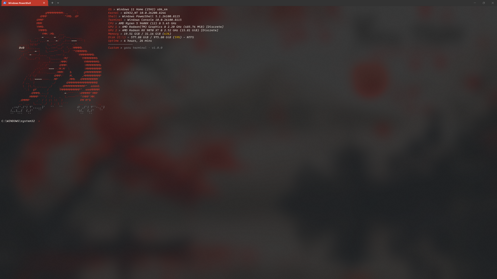

<div align="center">


# Yoru Terminal
 **A Premium Theme Ecosystem for Windows Terminal** 
[](https://github.com/microsoft/terminal)
[](https://github.com/microsoft/terminal)
[](https://github.com/PowerShell/PowerShell)
[](LICENSE)

</div>

---

## Introduction
 **Yoru Terminal** is a curated aesthetic and theme supplier platform designed exclusively for Windows Terminal. It transcends standard dotfile repositories by providing a cohesive, highly-designed visual architecture for your workstation. 

Built for developers, creators, and power users, Yoru Terminal transforms the traditional command-line interface into a cinematic, premium environment. It acts as a modular foundation where typography, color science, acrylic transparency, and shell integration harmonize to create a superior user experience.

## Vision & Philosophy

The terminal is the modern artisan's primary tool, yet it is often neglected aesthetically. The prevailing trends tend to lean toward overloaded, hyper-saturated RGB gaming aesthetics or uninspired, chaotic configurations. 

Yoru Terminal was engineered with a different philosophy:
* **Minimalism over Clutter** : Focusing on readability and purposeful design.
* **Cinematic Atmosphere** : Utilizing deep contrast, subtle transparency, and wallpaper-aware aesthetics.
* **Modular Evolution** : Establishing a platform where multiple distinct visual identities can be swapped, upgraded, and maintained effortlessly.

> "A premium workspace demands premium tooling. Yoru Terminal is the bridge between uncompromising functionality and workstation elegance."

## The Theme Architecture

Yoru Terminal is not a single configuration—it is an ecosystem. The platform utilizes a modular configuration architecture that allows users to seamlessly switch between completely different visual environments.

Every theme pack within the Yoru ecosystem dictates the full aesthetic experience:
1. **Windows Terminal Configuration** : Custom color palettes, typography tuning, and acrylic styling.
2. **PowerShell Profile** : Streamlined startup configurations and prompt designs.
3. **Fastfetch Layouts** : Tailored system information displays featuring custom ASCII art and data structures.

## Current Flagship Theme: *Sumi-e Crimson*

The inaugural visual identity of the Yoru Terminal platform draws heavy inspiration from traditional Japanese ink painting (Sumi-e) fused with modern, cinematic workstation aesthetics. 
 **Theme Characteristics:** * **Palette** : Deep charcoal and cinematic blacks offset by striking crimson maple accents.
* **Atmosphere** : Calm, premium, and minimal.
* **Fastfetch** : A custom, intricate crimson dragon ASCII integration that greets you upon initialization.
* **Transparency** : Carefully calibrated acrylic blur designed to interface beautifully with dark, monochrome, or cinematic wallpapers.

*(Note: While *Sumi-e Crimson* is the flagship, the Yoru platform is designed to house a diverse library of future visual identities.)*

## Feature Highlights

| Capability | Description |
| :--- | :--- |
| **Transformation System** | A complete visual overhaul for Windows Terminal, replacing default behaviors with a curated design language. |
| **Modular Architecture** | Decoupled configuration files. Install, remove, or swap theme environments without breaking your core setup. |
| **Typography Tuning** | Optimized font weight, line height, and character spacing for maximum readability and visual comfort. |
| **Acrylic Styling** | Native Windows 11 acrylic transparency configurations tuned to prevent text wash-out while maintaining depth. |
| **Fastfetch Integration** | Custom JSON-based Fastfetch layouts that replace generic system info with artful, theme-specific dashboards. |
| **Public-Use Ready** | Designed not just for personal dotfiles, but structured safely and logically for public adoption and deployment. |

## Gallery

<!-- Use standard Markdown image syntax to replace these placeholders -->

<div align="center">
  
  <br>
  <em>Sumi-e Crimson: Fastfetch, Starship, and the Yoru palette in Windows Terminal.</em>
</div>

## Installation

### Prerequisites

To utilize the Yoru Terminal ecosystem, ensure your system meets the following requirements:
* **Windows Terminal** (Version 1.18 or higher)
* **PowerShell 7+** (Core)
* **Fastfetch** (Available via `winget install fastfetch`)
* **Nerd Fonts** (We recommend *JetBrainsMono NF* or *CaskaydiaCove NF* for optimal iconography rendering)

### Step-by-Step Setup

1. **Clone the Repository**    ```powershell
   git clone https://github.com/yourusername/yoru-terminal.git
   cd yoru-terminal
   ```

2. **Deploy the Windows Terminal Configuration**    Open Windows Terminal settings (via `Ctrl + ,`), click on "Open JSON file", and merge the contents of `themes/sumi-e-crimson/settings.json` into your existing configuration. Alternatively, copy the specific color schemes and profile definitions.

3. **Deploy the Fastfetch Theme**    Copy the Yoru Fastfetch configuration to your local Fastfetch directory:
   ```powershell
   Copy-Item -Path ".\themes\sumi-e-crimson\fastfetch\*" -Destination "$env:USERPROFILE\.config\fastfetch\" -Recurse -Force
   ```

4. **Update PowerShell Profile**    Link or copy the Yoru PowerShell profile to streamline your startup:
   ```powershell
   Copy-Item -Path ".\core\profile.ps1" -Destination $PROFILE -Force
   ```

5. **Restart Terminal**    Close and reopen Windows Terminal to initialize the Yoru environment.

## Folder Structure

The repository is structured to prioritize modularity and future expansion.

```text
yoru-terminal/
├── core/
│   ├── profile.ps1           # Core PowerShell startup logic
│   └── modules/              # Reusable shell functions
├── themes/
│   ├── sumi-e-crimson/       # Flagship Theme Directory
│   │   ├── settings.json     # Windows Terminal profile & colors
│   │   ├── fastfetch/        # Custom JSON layout and ASCII art
│   │   └── assets/           # Recommended wallpapers
│   └── template/             # Boilerplate for future themes
├── docs/                     # Advanced customization guides
└── README.md
```

## Customization

While Yoru Terminal provides a polished out-of-the-box experience, it respects the needs of power users who wish to tune their environments. 

* **Adjusting Transparency** : Locate the `useAcrylic` and `opacity` keys within the Terminal `settings.json` profile block. Default opacity is calibrated to `0.85`.
* **Modifying the Fetch Art** : The dragon ASCII art is located in `themes/sumi-e-crimson/fastfetch/logo.txt`. You can replace this file to inject your own branding while maintaining the Yoru layout engine.
* **Color Overrides** : The `settings.json` includes a dedicated `"schemes"` array. You can adjust the crimson accents (`color1` and `color9`) to adapt the theme to your preference without breaking the underlying charcoal contrasts.

## Future Roadmap

The Yoru platform is in active development. Our roadmap for upcoming releases includes:

- [ ] **Automated Installation Engine** : A PowerShell-based CLI tool to seamlessly install and swap themes.
- [ ] **New Visual Identity - "Glacier"** : A premium, frosted-glass aesthetic utilizing arctic blues and stark whites.
- [ ] **New Visual Identity - "Monolith"** : A brutalist, pure-monochrome theme prioritizing zero distractions.
- [ ] **Oh-My-Posh Integration** : Official, branded prompt themes designed to match each Yoru visual pack.
- [ ] **Dynamic Wallpaper Sync** : Scripts to automatically adapt Terminal themes based on the active desktop background.

## Credits & Inspiration

This project leverages and is inspired by several outstanding open-source tools:

* [Windows Terminal](https://github.com/microsoft/terminal) by Microsoft.
* [Fastfetch](https://github.com/fastfetch-cli/fastfetch) for the highly performant system information architecture.
* [Nerd Fonts](https://www.nerdfonts.com/) for providing the typographic iconography that makes terminal design possible.

---

<div align="center">
  <em>Designed for the modern workspace.</em><br>
  <strong>Yoru Terminal</strong> © 2024
</div>